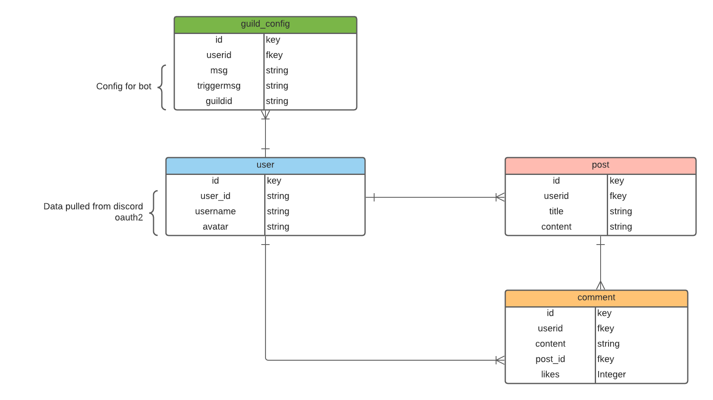

# The_WingmanBot

## Date: Oct/10/2021

### By: Zitai huang

[GitHub](https://github.com/Zitai01/The_WingmanBot) |
[Heroku]() |
[Trello](https://trello.com/b/RYA9hRSp/wingmanbot) |
[Linkedin](https://www.linkedin.com/in/zitai-huang/)

## **Description**
The Wingman Bot is a utility discord bot that improves discord user's overall experience in their guilds, In this project, we will focus on building the web app side of the bot.
***
### ERD

***
### Front end Hierarchy

***
## Getting started
The Wingman bot will only accept safe login with Discord via oauth2 and the only information We pull from discord are your username, userid and user's avatar.

## MVP
* Include a minimum of 3 models in Sequelize
* At least one full CRUD operations for post model
* functional components with Vue components
* Clean code with no unused code
* Be deploed (probably on Heroku) 
* oauth2 login with discord
## Additional objective
* Implement [JokeApi](https://sv443.net/jokeapi/v2/) to discord bot
* Allow users to authrize wingman bot to their guild.
* 
## Technologies used
* Express.js
* Node.js
* Vue.js
* Discord.js
* Sequelize
* PostgreSQL
* OAuth2 Authentication
***
## Future updates
There are lots for feature coming to the discord bot and it's webpage, I will continue work on this project and post future updates on deployed website.
## Credits
[JokeApi](https://sv443.net/jokeapi/v2/)